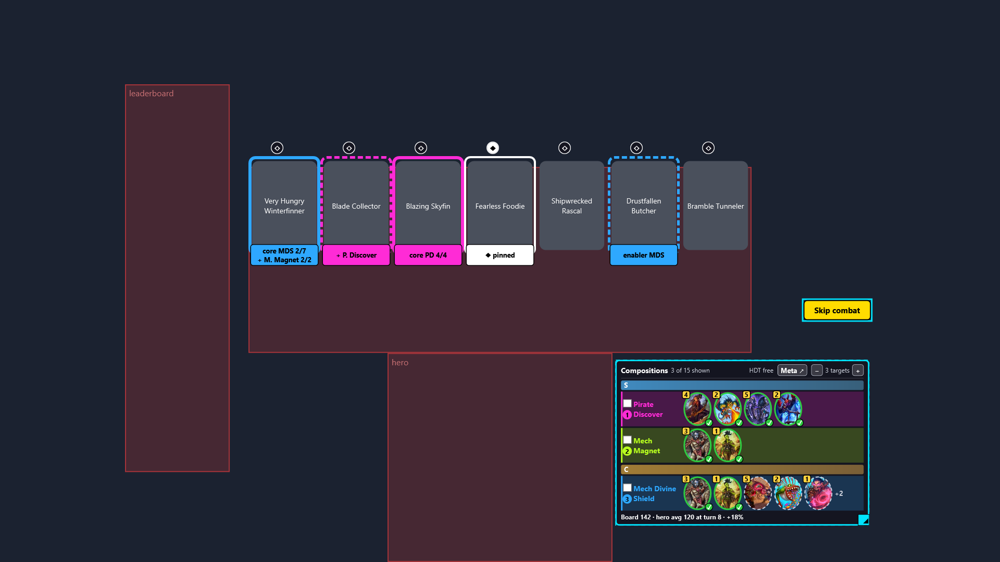

# Tavern Compass

[](https://github.com/elphono/tavern-compass/actions/workflows/ci.yml)

**A [Hearthstone Deck Tracker](https://hsdecktracker.net/) plugin for Battlegrounds that tells you which
composition to go for, frames the cards in Bob's tavern that move you toward it, and shows whether your board is
keeping up.**



*Captured in the [simulation](tools/BronzebeardHud.Harness/README.md), not in a live game: the card names and
frames are real plugin output on made-up data.*

## What you get

| | |
|---|---|
| **Compositions panel** | The comp guides HDT itself shows, grouped by tier (S → D). The ones your board **and** hand make most likely come first, in their own colour. Tick a box to say "this is the comp I'm going for". |
| **Frames in the tavern** | On Bob's cards: a solid frame for a key card of a target comp, a dotted one for an enabler or add-on, in that comp's colour. Several targets at once when you are in between two comps. |
| **Help with choices** | Discovers, trinkets and Dark Gifts: each option gets a label saying how it fits your targets (core card, add-on, pivot to another guide, share of top boards that run it). |
| **Lobby-aware** | Only guides your lobby's tribes can actually play are listed or suggested. |
| **Board power gauge** | Your board against the average board of your hero at the same turn (Firestone data): red, yellow, green, shiny. |
| **Hover and click for the full guide** | Hover a line for HDT's whole guide in a popup, click it to read it in the panel, as in HDT. |
| **Hero pick, MMR, Skip combat** | Firestone stats on the heroes offered, MMR of your opponents (leaderboard), and an experimental *Skip combat* button. |
| **Your layout** | *Plugins → Tavern Compass → Move panels*: drag and resize every panel; the size gives the content more or less room, it never scales it. No text below 12 px at 1080p, nothing is ever truncated. |

## Status

Early (v0.3), one maintainer. It is developed and played against **HDT 1.58.9**. The Compositions panel has been used
in live games; the lobby filter and the power gauge (October 2026), among others, have so far only run in the
simulation. The list is in the [roadmap](ROADMAP.md), under *To verify in a live game*.

## Install

There is no packaged release yet (see the [roadmap](ROADMAP.md)): build it.

```bash
dotnet build src/BronzebeardHud.HdtPlugin -c Release
```

Then copy `BronzebeardHud.HdtPlugin.dll` and `BronzebeardHud.Stats.dll` from `src/BronzebeardHud.HdtPlugin/bin/Release/net48/`
to `%AppData%\HearthstoneDeckTracker\Plugins\BronzebeardHud\`. **Do not** copy `Newtonsoft.Json.dll`: HDT loads
its own, in the same version. Restart HDT and enable the plugin in *Options → Plugins*.

The default build compiles against HDT 1.55.6, the last release published on GitHub. To compile against the HDT you
actually run (recommended), point at its folder:

```bash
dotnet build src/BronzebeardHud.HdtPlugin -c Release -p:HdtInstallDir=/path/to/HearthstoneDeckTracker/app-1.58.9/
```

## Data and privacy

- The plugin **never reads the game's memory**. HDT does, and the plugin only uses what HDT exposes.
- The comp guides are the ones HDT already downloads; **the plugin makes no HSReplay request**.
- Hero, comp and trinket statistics are Firestone's public aggregates, used with its author's permission, cached
  under `%LocalAppData%\BronzebeardHud\stats\` and re-checked with conditional requests (ETag) at startup.
- Card images come from [HearthstoneJSON](https://hearthstonejson.com/) and are cached locally.
- Nothing is sent anywhere: no account, no telemetry.

## Try it without playing

`tools/BronzebeardHud.Harness/` runs the real panels in an ordinary Windows window, on synthetic data, with no HDT
and no game. Handy to see a change, or to reproduce a layout problem. See [its README](tools/BronzebeardHud.Harness/README.md).

## Repository

| Path | What it holds |
|---|---|
| `src/BronzebeardHud.Stats` | Business logic (`netstandard2.0`): stats format, Firestone import, cache, ranking of comps, targets, power levels. No HDT, no WPF. |
| `src/BronzebeardHud.HdtPlugin` | The HDT plugin (`net48`): HDT adapter and WPF panels, written in C# with no XAML so it builds under Linux and WSL. |
| `tests/BronzebeardHud.Stats.Tests` | xUnit tests of the business logic. |
| `tools/BronzebeardHud.Harness` | The simulation. |
| `docs/` | Design notes, a development journal (in French) and research on HDT and Tier 7. |

`dotnet test` runs the whole suite, without network access.

## Not affiliated

Tavern Compass is a fan project. It is not affiliated with or endorsed by Blizzard Entertainment, HearthSim
(Hearthstone Deck Tracker), HSReplay.net or Firestone. Hearthstone and Battlegrounds are trademarks of Blizzard
Entertainment, Inc.
