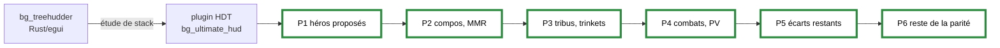

# Journal — 2026-09-26 : du tracker Rust au plugin HDT

Une journée : l'objectif (copier Firestone / HSReplay-Tier7) est fixé, la stack est changée, les six
phases du plan sont livrées et testées en partie sous Windows par Ali. Le détail des phases vit dans
`docs/plans/2026-09-26-parite-tier7-plan.md` ; ce journal ne garde que les décisions et leurs motifs.

## Décisions, dans l'ordre

| # | Décision d'Ali | Motif |
|---|---|---|
| 1 | viser une copie fidèle de Firestone et/ou HSReplay-Tier7 | — |
| 2 | étude de stack avant tout code ; si C#, partir de `bg_ultimate_hud` et non du Rust | ne pas investir dans une stack qu'on quitte |
| 3 | **option 3 : plugin HDT** (13 à 18 j estimés contre 26 à 42 j pour les autres) | le plus rapide ; HDT fournit déjà Bob's Buddy et l'overlay gratuit |
| 4 | stats : pages HSReplay lues à la main + JSON Firestone ; l'auteur de Firestone **accepte**, à nous de les récupérer | source automatique autorisée |
| 5 | dépôt passé en **privé** | usage strictement personnel |
| 6 | garder le MMR des adversaires malgré le plancher de 8 000 du leaderboard | — |
| 7 | conseiller de compositions prioritaire : board + main → compos cibles, marqueurs en taverne | la fonctionnalité qu'Ali veut en premier |
| 8 | « rajoute tout » : les écarts Tier7 restants deviennent la phase 6 | — |

## Ce que les tests en partie ont appris

| Symptôme vu par Ali | Cause mesurée | Correctif |
|---|---|---|
| panneau des héros en un seul bloc centré | constantes au jugé | positions tirées du code d'HDT (`02ebc3d`) |
| compos visées vides | cache écrit par la version précédente (`schema` 1, sans `referenceBoard`), jugé frais 7 jours | numéro de schéma + retéléchargement (`a51568b`) ; `comps=0` dit désormais pourquoi |
| texte des marqueurs coupé | largeur fixe | texte court, largeur calée sur la carte |
| panneau Combats illisible | 8 courbes sans légende, ni axes ni chiffres, placé au centre | classement par PV, repères chiffrés, bord de l'écran (`62ac336`) |
| carte au survol sous le panneau | ordre d'empilement | calque le plus haut (`fe2ac0b`) |

La leçon qui vaut pour la suite : **la ligne `Bronzebeard HUD: …` du journal d'HDT tranche en une
lecture** ce que plusieurs hypothèses plausibles laissaient ouvert (le cache vide n'était pas un
problème d'affichage). La lire avant de supposer.

## Mesures qui fondent les décisions

- Leaderboard EU : 121 pages, 3 022 joueurs, plancher à 8 000 MMR ; région EU établie par l'octet de
  région de l'identifiant de compte dans `BgsLastGames.xml`.
- HSReplay : challenge JavaScript Cloudflare (« Just a moment… ») — non contourné, par décision.
- Timewarped : aucun tag de la mécanique dans 811 002 lignes de log de la saison 14.
- HDT : GitHub s'arrête à la 1.55.6 ; le plugin compile sans erreur contre la 1.58.3 installée.

## Rapatriement de `bg_treehudder`

Le dépôt Rust a été vidé de ce qui avait de la valeur pour pouvoir être supprimé en local : format de
`Power.log`, étude de stack, recherche Tier7 (qui ne vivait que dans `/tmp`), et le dépôt entier en
bundle git (`docs/archive/`), restauration vérifiée (61 commits, branche WIP comprise).
