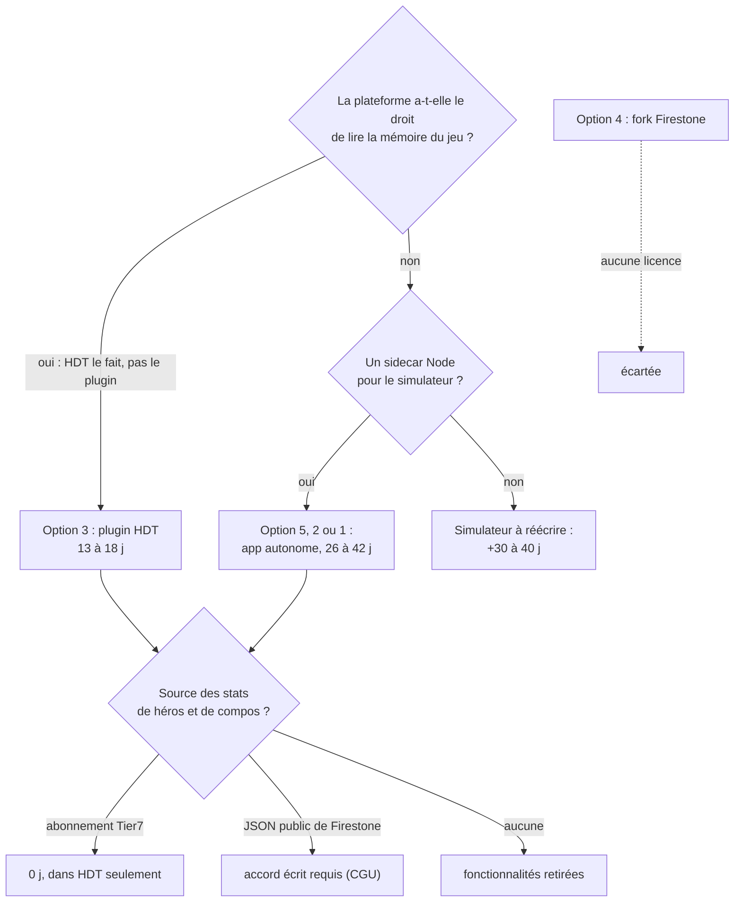
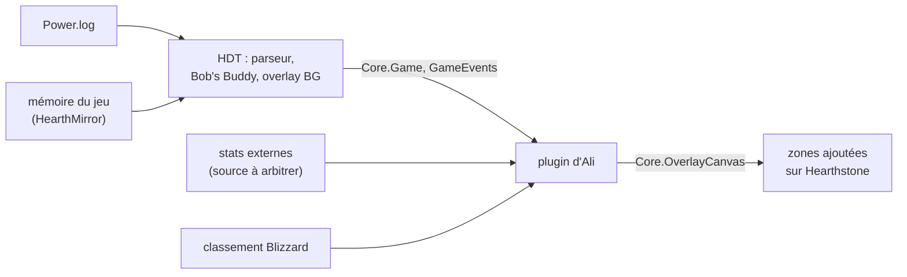

<!-- tablette : étude de stack -->

# Étude de stack : quelle voie mène le plus vite à la parité Firestone / HSReplay-Tier7

| Option | Ce qu'on récupère | Ce qui reste à écrire | Licence | Dépendances imposées | « Power.log seul » | Effort jusqu'à la parité |
|---|---|---|---|---|---|---|
| **1** Rust/egui (`bg_treehudder`) | 3 504 lignes, 81 tests verts, adversaires + popup au survol, MMR via leaderboard, build Windows qui passe | lots L1 à L7, dont une disposition multi-zones difficile en egui | code d'Ali | aucune | ✓ tenue | **31 à 41 j** |
| **2** C#/Avalonia (`bg_ultimate_hud`) | 1 657 lignes + 1 005 de tests (82 verts), parser et état portés, overlay de base | rattrapage du Rust (popup, MMR), puis L1 à L7 | code d'Ali | .NET 8 à migrer vers .NET 10 avant le 10/11/2026 | ✓ tenue | **30 à 42 j** |
| **3** Plugin Hearthstone Deck Tracker (C#/WPF) | l'overlay BG gratuit de HSReplay tel quel, simulateur Bob's Buddy compris | extras Firestone, stats de héros et de compos | HDT « All Rights Reserved », API de plugins prévue pour ça | HDT installé (Windows seulement) | ✗ HDT lit la mémoire | **13 à 18 j** |
| **4** Fork de Firestone | tout Firestone, en théorie | la prise en main de ~300 000 lignes Angular | **aucune licence**, CGU hostiles | Overwolf (client ou `ow-electron`) | ✗ `mind-vision` | **bloqué** sans accord écrit |
| **5** C# autonome + briques MIT | option 2 + HearthDb + parseur C# de Firestone | L1 à L7, allégés | MIT (briques) | Node.js (simulateur), réseau | ✓ tenue | **26 à 39 j** |

*j* = jours de travail, estimés au jugé à ±30 % à partir des mesures ci-dessous. **Les options 1, 2 et 5
supposent toutes le simulateur de combat de Firestone lancé en processus auxiliaire (un « sidecar »)** :
sans lui, il faut réécrire un simulateur, soit 30 à 40 j de plus.

## Ce que « parité » veut dire ici, et comment l'effort se décompose

La cible, c'est l'inventaire de `research-tier7` (overlay gratuit de HDT et fonctionnalités Tier7) plus les
fonctionnalités BG du wiki Firestone. On en retire ce qui exige la **mémoire** du jeu (tribus bannies au
tour 0, MMR du joueur) et le contenu **rédactionnel** (guides écrits par Jeef).

| Lot | Contenu | 1 Rust | 2 C# | 3 HDT | 5 C#+MIT |
|---|---|---|---|---|---|
| L0 rattrapage | popup adversaire, MMR adverses, diff Rust non commité | 0 | 3–4 | 0–1 (MMRadar) | 3–4 |
| L1 état de jeu | triples, trinkets, quêtes, anomalie, compteurs, historique PV et combats | 4–6 | 4–6 | 1 | 2–4 |
| L2 disposition | zones autour de la fenêtre HS, survol, click-through sélectif | 8–10 | 4–6 | 3–4 | 4–6 |
| L3 navigateur de sbires | par tier, tribu, mécanique | 3–4 | 3–4 | 0 | 2–3 |
| L4 cotes de combat | simulateur Firestone en sidecar + adaptateur plateau → entrée | 7–9 | 7–9 | 0 (Bob's Buddy) | 5–7 |
| L5 stats externes | héros, compos, trinkets, quêtes par tranche de MMR | 3–5 | 3–5 | 3–5 | 3–5 |
| L6 session | placements, graphe des PV, combats rejouables | 3–4 | 3–4 | 2 | 3–4 |
| L7 finition | réglages, packaging, tenue aux patchs | 3 | 3–4 | 2 | 3–4 |
| prise en main | API ou code étranger à apprendre | 0 | 0 | 2–3 | 1–2 |
| **Total** | | **31–41** | **30–42** | **13–18** | **26–39** |

## Option 1 : rester en Rust/egui

- **Récupéré** : le pipeline complet, 3 504 lignes commitées (et non ~7 000 : mesure `git ls-files '*.rs'`),
  250 lignes non commitées (coût de montée de taverne, place au classement, prochain adversaire,
  pouvoir héroïque, tribus du plateau), 81 tests verts ; `cargo build --target x86_64-pc-windows-gnu --release` passe.
- **Reste** : L1 à L7. Le lot le plus cher est L2 : egui dessine **une** fenêtre, donc une disposition à
  plusieurs zones autour de Hearthstone demande une fenêtre transparente couvrant le jeu, avec un
  click-through sélectif écrit à la main en Win32. Ce click-through a déjà été retiré une fois (`36d1fcb`).
- **Licence et dépendances** : aucune. `serde_json` est déjà là pour dialoguer avec le simulateur.
- **Power.log seul** : tenue. **Effort** : 31 à 41 j.

## Option 2 : reprendre `bg_ultimate_hud`

- **Récupéré** : lexer, watcher et moteur portés ; 82 tests verts (23 + 52 + 7, mesurés sur une copie
  clonée). `dotnet publish -r win-x64` depuis WSL produit un exécutable Windows sans autre outillage : la
  douleur de la cross-compilation disparaît. **Pas** de popup adversaire, **pas** de MMR (aucun client de
  leaderboard), pas le diff Rust non commité.
- **Reste** : L0, puis L1 à L7. L2 coûte moitié moins qu'en egui (XAML, fenêtres multiples, liaisons).
- **Dépendances** : sous WSL, le placement de la fenêtre passe par un utilitaire Windows **hors dépôt**
  (`C:\temp\HsHelper`) ; .NET 8 perd son support le 10 novembre 2026, il faut passer en .NET 10 (SDK
  absent de cette machine).
- **Power.log seul** : tenue. **Effort** : 30 à 42 j, du même ordre que le Rust : l'UI plus rapide
  compense à peine le rattrapage.

## Option 3 : plugin Hearthstone Deck Tracker

- **Récupéré** : HDT **est** l'overlay gratuit de HSReplay : Bob's Buddy (cotes de combat), navigateur de
  sbires, widget de session (MMR, tribus bannies), dernier plateau au survol du classement du jeu,
  compteurs. Les fonctionnalités Tier7 y sont payantes (2 parties gratuites par semaine). Le MMR des
  adversaires existe déjà en plugin : MMRadar, sous MIT, mis à jour le 2026-08-08.
- **API** : `IPlugin` ; `Core.Game`, l'état de partie ; `Core.OverlayCanvas`, une toile WPF posée sur
  Hearthstone ; `GameEvents` (`OnGameStart`, `OnTurnStart`…). HDT cible `net472`.
- **Boucle de dev** : un plugin dont l'UI est écrite en C# compile sous WSL (mesuré) ; le XAML WPF, lui,
  ne compile pas sous Linux (mesuré : SDK WindowsDesktop absent). Tester exige Windows et HDT.
- **Licence** : README de HDT : « Copyright © HearthSim. All Rights Reserved. » On ne copie donc pas son
  code, mais l'API de plugins est l'usage prévu. HearthMirror (la lecture mémoire) et Bob's Buddy sont
  des binaires fermés téléchargés depuis `libs.hearthsim.net`.
- **Power.log seul** : la contrainte **saute au niveau de la plateforme**. HDT lit la mémoire ; le plugin
  n'a pas à le faire, mais l'état qu'il reçoit en dépend. Ce que ça rapporte : les tribus bannies dès le
  tour 0, le MMR du joueur, la cible du survol du classement du jeu, et les noms du lobby, donc des MMR
  adverses fiables. À Ali de trancher.
- **Ce qu'on reprend de `bg_ultimate_hud`** : peu de chose. Le parser et le moteur font doublon avec
  HDT, et le XAML Avalonia n'est pas du WPF. Restent le cache d'images (83 lignes) et les modèles
  (57 lignes).
- **Effort** : 13 à 18 j, et 0 j pour toute la part gratuite de HSReplay.

## Option 4 : partir du code de Firestone

- **Licence** : aucun fichier LICENSE dans `Zero-to-Heroes/firestone` (l'API GitHub rend 404) ;
  `package.json` porte `"private": true` et aucun champ `license`. Sans licence, tous les droits sont
  réservés. Les CGU interdisent en plus de « modify, copy, distribute […] without our express prior
  written permission ». La voie légitime est de contribuer en amont (`CONTRIBUTING.md`).
- **Overwolf** : l'app publiée tourne sur Overwolf. Le build Electron du dépôt passe par
  `@overwolf/ow-electron` et son paquet `overlay` : il quitte le **client** Overwolf, pas sa technologie.
  Pour développer, il faut en plus avoir installé le Firestone officiel.
- **Ce qui vient de la mémoire** (`mind-vision`, `OverwolfUnitySpy.dll`) : le MMR du joueur, les tribus
  disponibles et, pour chaque joueur, nom, MMR, triples, série de victoires et combats ; s'y ajoutent le
  plateau, la main et les trinkets du joueur. **Ce qui vient des logs** : `HearthstoneReplays.dll`, un
  parseur C# (31 parseurs BG). Le MMR des adversaires vient d'une recherche de nom sur le classement
  officiel, « not totally reliable ».
- **Taille** : ~300 000 lignes TS/HTML/SCSS (octets ÷ 35), dont ~23 000 sous `libs/battlegrounds`.
- **Effort** : 0 j pour *utiliser* Firestone. Le forker est bloqué juridiquement, et demanderait au moins
  10 j de prise en main.

## Option 5 : les briques réutilisables, et leur assemblage en C#

| Brique | Licence | Ce qui a été mesuré | Ce qu'elle apporte |
|---|---|---|---|
| Simulateur `@firestone-hs/simulate-bgs-battle` 1.1.759 | `MIT` dans `package.json`, **sans fichier LICENSE** ; dépôt source en 404 | tourne seul sous Node 24 : 100 % de victoires, puis 100 % de défaites plateaux inversés | évite 30 à 40 j de réécriture ; appelable depuis Rust ou C# |
| HearthDb (HearthSim) | MIT, `netstandard2.0` | — | cartes et `GameTag` en C#, remplace `bg_cards.tsv` |
| Parseur C# de Firestone (`hs-game-converter-csharp-port`) | MIT, `net48` | dernier commit public le 2026-03-25 (patch 35.0) ; le jeu est en 36.6 | événements BG : achats, gel, combats, plateaux ; compatibilité `net48` vers .NET 8 **non mesurée** |
| HearthMirror, Bob's Buddy | aucune (binaires fermés) | — | inutilisables hors de HDT |
| Stats agrégées de Firestone (JSON public) | CGU : pas de téléchargement sans permission écrite | HTTP 200, 112 héros, mis à jour le 2026-09-26 à 12:10 UTC | le lot L5 sans backend : **arbitrage** |

Le simulateur télécharge au démarrage la base de cartes de `static.zerotoheroes.com` : il dépend du
réseau et des mêmes CGU tant qu'on ne lui fournit pas une base locale. **Effort de l'assemblage C#** :
26 à 39 j. Le gain sur l'option 2 est incertain, parce qu'il repose sur un parseur au retard non mesuré.

*Chaîne de l'option 3 : la mémoire entre par HDT, jamais par le plugin.*

## Recommandation

Recommandation : option 3 — plugin Hearthstone Deck Tracker (C#)

**Pourquoi** : 13 à 18 j, contre 26 à 42 j pour les voies autonomes (1, 2, 5). HDT livre déjà toute la
part gratuite de l'inventaire, simulateur compris, ce qu'aucune autre option n'apporte. Le critère
d'Ali est la vitesse, et c'est là que l'écart est le plus grand.

**À une condition, qu'Ali seul peut lever** : accepter que la plateforme lise la mémoire. S'il maintient
« Power.log seul » jusqu'au niveau de la plateforme, la voie la plus rapide devient l'option 2 ou 5 (C#
autonome et simulateur Firestone en sidecar), entre 26 et 42 j.

| Si on revient sur… | on garde | on perd |
|---|---|---|
| 3, plugin HDT | client de stats, recherche MMR, adaptateur vers le simulateur | l'UI WPF et les liaisons à HDT, soit environ la moitié du travail |
| 1, Rust | le pipeline de référence, le protocole JSON du simulateur | l'UI egui |
| 2 ou 5, C# autonome | les services C#, réutilisables dans un plugin HDT | l'UI Avalonia (ce n'est pas du WPF) |
| 4, fork Firestone | rien | toute la prise en main, plus le risque juridique |

## Arbitrages qui reviennent à Ali

1. La mémoire au niveau de la plateforme (option 3) : oui ou non.
2. La source des stats de héros et de compos : abonnement Tier7, JSON de Firestone avec accord écrit, ou pas de stats.
3. Le simulateur npm déclaré MIT sans fichier LICENSE ni dépôt public : l'utiliser tel quel, ou demander confirmation à son auteur.

## Sources

- Firestone : <https://github.com/Zero-to-Heroes/firestone> (README, `tos.md`, `package.json`, `electron-prep.md`,
  `CONTRIBUTING.md`, `libs/memory`) · <https://github.com/Zero-to-Heroes/firestone/wiki/Firestone-features> ·
  <https://github.com/Zero-to-Heroes/firestone/wiki/Premium-features> · <https://www.overwolf.com/app/sebastien_tromp-firestone> ·
  <https://www.firestoneapp.com/downloads> (rendu en JavaScript, illisible par extraction)
- Briques Firestone : <https://www.npmjs.com/package/@firestone-hs/simulate-bgs-battle> ·
  <https://github.com/Zero-to-Heroes/api-simulate-battlegrounds-battle> (404) ·
  <https://github.com/Zero-to-Heroes/hs-game-converter-csharp-port> ·
  <https://static.zerotoheroes.com/api/bgs/hero-stats/mmr-100/last-patch/overview-from-hourly.gz.json>
- HDT : <https://github.com/HearthSim/Hearthstone-Deck-Tracker> (README, `Bootstrap/Bootstrap.csproj`,
  `API/Core.cs`, `API/GameEvents.cs`) · <https://github.com/HearthSim/HearthDb> ·
  <https://github.com/lowerman/MMRadar_HDT_BG>
- .NET : <https://devblogs.microsoft.com/dotnet/dotnet-8-9-end-of-support/>
- Inventaire HSReplay / Tier7 : les sources de `research-tier7.md` (scratchpad de session, non versionné).
