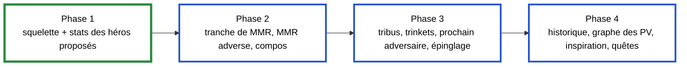

<!-- tablette : plan du plugin HDT -->

# Plan : plugin HDT pour la parité Firestone / HSReplay-Tier7

Suite de la spec `2026-09-26-parite-tier7-spec.md`. Quatre phases, dans l'ordre de la valeur
apportée ; chacune se termine par des tests verts sous WSL et une liste de contrôles à faire sous
Windows.

## Structure du code

| Projet | Cible | Contenu | Dépend de |
|---|---|---|---|
| `src/BronzebeardHud.Stats` | `netstandard2.0` | format local, chargeur, import Firestone, cache, tiers, héros proposés, lignes du panneau | Newtonsoft.Json 13.0.3, la version que charge HDT |
| `src/BronzebeardHud.HdtPlugin` | `net48` | `IPlugin`, panneau WPF écrit en C# (sans XAML), adaptation des entités HDT | HDT (téléchargé, hors git), `BronzebeardHud.Stats` |
| `tests/BronzebeardHud.Stats.Tests` | `net8.0` | xUnit, comme les autres projets de test | `BronzebeardHud.Stats` |

Le plugin reste **hors de la solution** : `dotnet test` n'a ainsi besoin ni du réseau ni de HDT. La
bibliothèque et ses tests y entrent. L'assembly HDT est téléchargée par une cible MSBuild du projet
plugin, dans `lib/hdt/<version>/`, qui est ignoré par git.

## Phase 1 : squelette et stats des héros proposés

| Fonctionnalité | Fichiers | Tests (valeurs distinctes) |
|---|---|---|
| F1. Format local et chargeur | `HeroStatsFile.cs`, `HeroStatsLoader.cs`, `StatsFormatException.cs` | fichier valide à trois héros différents ; JSON cassé ; schéma inconnu ; champ manquant ; place hors de [1, 8] ; héros en double ; source inconnue |
| F2. Import Firestone et cache | `FirestoneEndpoints.cs`, `FirestoneHeroStatsImporter.cs`, `StatsCache.cs`, `RefreshPolicy.cs`, `IStatsFetcher.cs`, `HttpStatsFetcher.cs` | conversion d'un extrait synthétique (taux de choix, distribution) ; URL par tranche et période ; cache frais → aucun appel ; cache périmé → un appel ; échec → cache conservé et délai d'1 h ; réponse malformée → cache intact |
| F3. Tiers et lignes du panneau | `HeroTiers.cs`, `HeroIdNormalizer.cs`, `OfferedHeroes.cs`, `HeroPickAdvisor.cs` | bornes des tiers S à E sur des places distinctes ; tier fourni par la source prioritaire ; skins ramenés au parent ; héros verrouillé exclu ; héros sans stats signalé ; ordre des héros proposés |
| F4. Squelette du plugin | `Plugin.cs`, `HeroPickPanel.cs`, `HdtEntityAdapter.cs` | aucun sous WSL (dépend de HDT) ; le build doit passer |

**Sous WSL** : tous les tests, et le build du plugin. **Sous Windows** : les cinq points de la section 5
de la spec.

## Phase 2 : tranche de MMR, MMR adverse, compositions

| Fonctionnalité | Fichiers | Tests |
|---|---|---|
| Tranche de MMR | `MmrBracket.cs` (MMR → percentile, d'après `mmr-percentiles`) | MMR sous le seuil du top 50 %, entre deux seuils, au-dessus du top 1 % ; table vide |
| MMR des adversaires | `LeaderboardClient.cs`, `LeaderboardIndex.cs` (port de `leaderboard.rs`) ; `OpponentMmrPanel.cs` | nom avec ou sans `#1234` ; casse ; homonymes (on garde le meilleur MMR) ; page malformée ; pages bornées |
| Stats de compositions | `CompStatsFile.cs`, `FirestoneCompStatsImporter.cs` ; `CompPanel.cs` | conversion sans `finalBoards` ; affinité avec un héros ; âge du cache 7 jours |

Le leaderboard Blizzard se lit page par page : la phase 2 fixe un plafond de pages et un cache d'une
session. **Sous Windows** : noms du lobby fournis par `Core.Game.MetaData.BattlegroundsLobbyInfo`,
placement des panneaux.

## Phase 3 : tribus, trinkets, prochain adversaire, épinglage

| Fonctionnalité | Fichiers | Tests |
|---|---|---|
| Impact des tribus du lobby | `TribeImpact.cs` (règle `buildHeroStats` de Firestone) | tribus absentes, présentes, filtrage des effectifs trop faibles |
| Stats de trinkets | `FirestoneTrinketStatsImporter.cs`, `TrinketPanel.cs` | conversion, trinkets proposés |
| Prochain adversaire | `NextOpponent.cs` | identifiant présent, absent, joueur mort |
| Épinglage en taverne | `TavernPins.cs`, `PinOverlay.cs` | épingle, retire, persiste d'une partie à l'autre |

## Phase 4 : historique, graphe des PV, inspiration, quêtes

`CombatHistory.cs`, `HealthGraph.cs`, `InspirationBoards.cs`, `QuestStats.cs`, testés sur des
séquences de trois tours au moins, pour qu'un état qui se piège lui-même se voie. **Sous Windows** :
tout le rendu.

## Ce qui reste un arbitrage d'Ali

1. Les tranches de MMR de HSReplay n'ont pas été vérifiées (le site nous répond 403) : pour une
   saisie manuelle, `mmrPercentile` reçoit le percentile affiché par HSReplay s'il en montre un, et
   reste vide sinon.
2. Le plafond de pages du leaderboard (phase 2) : un classement complet représente plusieurs centaines
   de requêtes.
