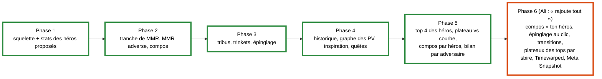

<!-- tablette : plan du plugin HDT -->

# Plan : plugin HDT pour la parité Firestone / HSReplay-Tier7

Suite de la spec `2026-09-26-parite-tier7-spec.md`. Six phases, dans l'ordre de la valeur
apportée ; chacune se termine par des tests verts sous WSL et une liste de contrôles à faire sous
Windows.

## Structure du code

| Projet | Cible | Contenu | Dépend de |
|---|---|---|---|
| `src/BronzebeardHud.Stats` | `netstandard2.0` | format local, chargeur, import Firestone, cache, tiers, héros proposés, lignes du panneau | Newtonsoft.Json 13.0.3, la version que charge HDT |
| `src/BronzebeardHud.HdtPlugin` | `net48` | `IPlugin`, panneau WPF écrit en C# (sans XAML), adaptation des entités HDT | HDT (téléchargé, hors git), `BronzebeardHud.Stats` |
| `tests/BronzebeardHud.Stats.Tests` | `net8.0` | xUnit, comme les autres projets de test | `BronzebeardHud.Stats` |

Le plugin reste **hors de la solution** : `dotnet test` n'a ainsi besoin ni du réseau ni de HDT. La
bibliothèque et ses tests y entrent. L'assembly HDT est téléchargée par une cible MSBuild du projet
plugin, dans `lib/hdt/<version>/`, qui est ignoré par git.

## Phase 1 : squelette et stats des héros proposés

| Fonctionnalité | Fichiers | Tests (valeurs distinctes) |
|---|---|---|
| F1. Format local et chargeur | `HeroStatsFile.cs`, `HeroStatsLoader.cs`, `StatsFormatException.cs` | fichier valide à trois héros différents ; JSON cassé ; schéma inconnu ; champ manquant ; place hors de [1, 8] ; héros en double ; source inconnue |
| F2. Import Firestone et cache | `FirestoneEndpoints.cs`, `FirestoneHeroStatsImporter.cs`, `StatsCache.cs`, `RefreshPolicy.cs`, `IStatsFetcher.cs`, `HttpStatsFetcher.cs` | conversion d'un extrait synthétique (taux de choix, distribution) ; URL par tranche et période ; cache frais → aucun appel ; cache périmé → un appel ; échec → cache conservé et délai d'1 h ; réponse malformée → cache intact |
| F3. Tiers et lignes du panneau | `HeroTiers.cs`, `HeroIdNormalizer.cs`, `OfferedHeroes.cs`, `HeroPickAdvisor.cs` | bornes des tiers S à E sur des places distinctes ; tier fourni par la source prioritaire ; skins ramenés au parent ; héros verrouillé exclu ; héros sans stats signalé ; ordre des héros proposés |
| F4. Squelette du plugin | `Plugin.cs`, `HeroPickPanel.cs`, `HdtEntityAdapter.cs` | aucun sous WSL (dépend de HDT) ; le build doit passer |

**Sous WSL** : tous les tests, et le build du plugin. **Sous Windows** : les cinq points de la section 5
de la spec.

## Phase 2 : tranche de MMR, MMR adverse, compositions

| Fonctionnalité | Fichiers | Tests |
|---|---|---|
| Tranche de MMR (livrée) | `MmrBracket.cs` ; la table `mmrPercentiles` vient du fichier de héros lui-même, sans endpoint de plus | MMR sous le seuil du top 50 %, pile sur un seuil, entre deux seuils, au-dessus du top 1 % ; table vide ; pas de note |
| MMR des adversaires (livré) | `Leaderboard.cs` (client, index, lobby → tuile, disposition) ; `OpponentMmrPanel.cs` | page 1 puis remontée depuis la dernière, arrêt au-dessus de la plage, pause d'1 s, plafond de 60 pages ; nom avec `#1234` et casse ; homonymes ; page non-200 ; JSON tronqué ; lobby → tuile par le héros |
| **Conseiller de compositions** (prioritaire, livré) | `CompositionFile.cs`, `FirestoneCompImporter.cs`, `HsReplayCompText.cs`, `CompAdvisor.cs`, `TavernLayout.cs` ; `CompService.cs`, `TavernAdvicePanel.cs` | classement sur 3 tours successifs, carte utile à deux compos, plateau vide, compo sans pièce, cartes clés par fréquence, texte HSReplay, cache 7 jours, disposition 3 à 7 sbires |
| Stats de compositions | intégrées au conseiller (import, cache, place moyenne dans le panneau) | — |

**Sous Windows** : noms du lobby fournis par `Core.Game.MetaData.BattlegroundsLobbyInfo`, placement
des panneaux.

### MMR des adversaires : quelle tranche du leaderboard télécharger

Décision d'Ali (2026-09-26) : la tranche qui tombe autour de son MMR, ajustable ensuite. **Région EU**,
établie par mesure et non supposée : l'identifiant de compte de ses parties dans HDT
(`BgsLastGames.xml`, attribut `Player`) a pour partie haute `0x200000257544347`, dont l'octet de
région vaut 2, c'est-à-dire EU (même décodage que `Helper.GetRegion` d'HDT).

Mesure du 2026-09-26 sur `hearthstone.blizzard.com/en-us/api/community/leaderboardsData?region=EU&leaderboardId=battlegrounds&page=N`
(saison 19 ; 121 pages de 25 joueurs, 3 022 joueurs en tout) :

| Page | Rangs | MMR |
|---|---|---|
| 1 | 1 – 25 | 14 613 – 18 218 |
| 40 | 976 – 1 000 | 8 782 – 8 803 |
| 65 | 1 601 – 1 625 | 8 244 – 8 261 |
| 90 | 2 226 – 2 250 | 8 050 – 8 052 |
| 105 | 2 601 – 2 625 | 8 022 – 8 024 |
| 121 | 3 001 – 3 022 | 8 000 |

**Le leaderboard s'arrête à 8 000.** Ali est à 6 840 : la marge envisagée (−600 / +800, soit 6 240 à
7 640) ne contient aucune page. La tranche retenue par défaut est donc le bas du classement, la plus
proche de son MMR : **8 000 à 8 050, soit les pages 90 à 121 ce jour-là (32 requêtes)**. Chaque page
pèse 304 Ko, dont 1,5 Ko de lignes ; le reste est de la métadonnée de saison.

| Réglage | Valeur par défaut | Où le changer |
|---|---|---|
| `LeaderboardRange` : `Region`, `MinRating`, `MaxRating` | `EU`, 8 000, 8 050 | `LeaderboardRange.Default` dans `src/BronzebeardHud.Stats/LeaderboardRange.cs` ; le plugin n'a pas encore d'écran de réglages |

Les bornes sont en MMR, et non en pages, pour deux raisons : Ali raisonne en MMR, et une page glisse
pendant la saison à mesure que des joueurs passent 8 000. Le client de la phase 2 convertira donc les
bornes en pages au moment de télécharger : il part de la dernière page et remonte tant que le MMR
reste sous `MaxRating`.

## Phase 3 : tribus, trinkets, épinglage

| Fonctionnalité | Fichiers | Tests |
|---|---|---|
| Impact des tribus du lobby (livré) | `LobbyTribes.cs` (règle `buildHeroStats` de Firestone), `tribeImpacts` dans le format local | tribus présentes ou absentes, effectifs trop faibles écartés, lobby complet ou inconnu, héros sans chiffre écarté, saisie manuelle laissée intacte |
| Stats de trinkets (livré) | `TrinketStats.cs` (format, import) ; affichage repris par le conseil de choix (phase 4) | place par tranche et repli, entrées impossibles écartées, fichier malformé, choix de trinkets seulement, choix terminé, 2 à 4 trinkets |
| Prochain adversaire | **retiré — déjà affiché nativement par le jeu** (décision d'Ali, 2026-09-26). Marqueur, garde `next-opponent`, `NextOpponent.cs` et ses tests supprimés ; seul reste le cadre du prochain adversaire dans le classement du panneau Combats (`Standings`, via `NEXT_OPPONENT_PLAYER_ID`) | — |
| Épinglage en taverne (livré, **reclassé** : par fichier `stats\manual\pins.txt` ; l'épinglage d'un clic est reporté, car il rendrait l'overlay cliquable au-dessus du jeu) | `TavernPins.cs` ; marqueur ◆ dans `TavernAdvicePanel.cs` | épingle, retire, ré-épingle, persiste d'une partie à l'autre, noms et identifiants, carte inconnue |

## Phase 4 : historique, graphe des PV, inspiration, quêtes

| Fonctionnalité | Fichiers | Tests |
|---|---|---|
| Historique des combats et graphe des PV (livrés) | `GameTimeline.cs` (traceur, courbes, `HistoryLayout`) ; `GameHistoryPanel.cs` | trois combats successifs (victoire, défaite, égalité) observés plusieurs fois chacun, PV d'avant combat pris en boutique, une valeur par tour, remise à zéro, échelle du graphe, panneau hors de la taverne |
| Panneau Combats refondu (retour d'Ali) | `GameTimeline.cs` (`Standings`, `CombatText`, `ChartAxes`, `HistoryLayout` en haut à droite, plus large que haut) ; `GameHistoryPanel.cs` | classement avec égalités et prochain adversaire, libellés sur trois tours, graduations 40/60 PV et 3/8/15 tours, rectangle hors plateau, hors classement et hors panneau des compos, en 16:9, 21:9 et 4:3 |
| Conseil de choix (retour d'Ali : « à chaque découverte ») | `ChoiceOptions.cs` (ordre affiché = ordre du choix, `Player.OfferedEntityIds`), `ChoiceAdvice.cs` (types de choix selon la règle d'HDT, moteur `CardEffect` partagé avec la taverne, note de trinket ajustée « ≈ », heuristique bornée à 0,3 place), `ChoiceLayout.cs` (constantes `RegionDrawer` d'HDT) ; `ChoiceAdvicePanel.cs`, garde `discover-advice` qui remplace `trinket-choice` | ordre réel du log d'Ali (3436, 3434, 3437, 3435), 3 options (compo en cours, compo atteignable, neutre) avec n/m avant → après, choix à 2 et 4 options, trois choix successifs, trinkets ajustés 1 / 0,5 / 0, géométrie 2-3-4 options en 2 000 × 1 220 et 2 291 × 1 360 |
| Marqueurs de taverne recentrés et suivis (retour d'Ali) | `TavernRow.cs` : la rangée de Bob compte le sort de taverne, que le jeu place en dernière position et centre avec les sbires (marqueurs décalés d'une demi-carte, +87 px en 2 290 × 1 359, sans lui) ; `TavernRowTracker` redessine à chaque changement de la rangée (achat, relance, carte ajoutée) ; ligne de journal en fin de tour avec `minions=`, `changes=`, `refreshes=` | rangée réelle du tour 14 d'Ali, 3 à 7 cartes en 1 920 × 1 080, 2 290 × 1 359, 2 560 × 1 080 et 1 600 × 1 200, trois tours avec achats, relances, gel et carte ajoutée |
| Panneau des compos : survol, cases à cocher, couleurs (retour d'Ali) | survol d'une vignette → carte entière par les infobulles d'HDT (`IsOverlayHoverVisible`, `OverlayExtensions.ToolTip`, image `cardImageDownloader`) ; case à cocher par compo, cliquable overlay verrouillé (`IsOverlayHitTestVisible`, comme les boutons d'HDT) ; `CompositionSelection.cs` : seules les compos cochées sont visées en taverne et en Découverte, même hors classement, oubliées à la partie suivante ; une couleur par compo cochée (magenta, lime, bleu ciel, blanc), gardée toute la partie, sur sa ligne et sur les marqueurs de ses sbires ; blanc sans compo cochée ; garde `comp-selection` | trois boutiques dont une où la compo cochée sort du classement, nouvelle partie, Découvertes, couleurs stables sur trois classements, cinquième case refusée, contraste et distance à l'orange de la palette, cochée en combat |
| Plateaux d'inspiration (livrés) | `inspirationBoards` dans le format des compos, tirés des plateaux finaux de Firestone ; ligne « Inspiration » dans `TavernAdvicePanel.cs` | trois plateaux au plus haut MMR, doublon écarté, aller-retour du format, plateau de 8 cartes refusé |
| Stats de quêtes | **coupées** : le fichier de quêtes de Firestone est vide sur le dernier patch (`questStats: []`, `dataPoints: 0`, mesuré le 2026-09-26) | — |

**Sous Windows** : tout le rendu.

**Règle, arrêtée le 2026-09-26** : le plugin ne duplique rien de ce que le jeu ou HDT affichent déjà
**gratuitement** ; une fonction Tier7 payante d'HDT (Tavern Markers, par exemple) peut être reproduite,
c'est l'objet même du plugin.

## Phase 5 : écarts restants, classés pour ≈ 6 800 de MMR

Inventaire vérifié dans le code d'HDT (HearthSim/Hearthstone-Deck-Tracker, master 509bb0b) :

| Fonction de Firestone ou HSReplay | Déjà affichée ? | Décision |
|---|---|---|
| Compteurs (gemmes de sang, or du tour suivant…) | HDT : 17 compteurs, `Hearthstone/CounterSystem/BgCounters/` | exclu |
| Navigateur de sbires, tier 7, Dark Paradox | HDT : `BattlegroundsMinionsViewModel.cs:143-190` (tier 7), `:202-225` (Dark Paradox) | exclu |
| Widget de session (MMR, dernières parties) | HDT : `BattlegroundsSessionViewModel.xaml.cs:36-110` | exclu |
| Survol d'un adversaire : dernier plateau et son âge, divinité, triples et montées par tier | HDT : `BattlegroundsOpponentInfo.xaml.cs:31-42, 59-108` | exclu |
| Probabilité du prochain combat | HDT : Bob's Buddy (`BobsBuddyInvoker`, présent dans le journal d'Ali) | exclu, tout comme le `combatWinrate` de Firestone qui le recoupe |
| Prochain adversaire, sbires dorés | le jeu | exclu |
| Boutique Timewarp | HDT, pour Tier7 seulement (`OverlayWindow.xaml.cs:1719-1730`) ; aucune dans le log d'Ali du 2026-09-26 | reporté tant qu'elle n'apparaît pas |
| Top 4 et 1re place par héros | non (Tier7, payant) | **5.1** |
| Force du plateau contre la courbe du héros (`warbandStats` : somme ATK + PV du plateau au combat, par tour) | non | **5.2** |
| Meilleures compos d'un héros (`heroStats` des compos : place moyenne par héros) | non | **5.3** |
| Bilan contre chaque adversaire (victoires, défaites) | non dans HDT (le survol n'en montre pas) ; **non vérifié** dans l'interface du jeu | **5.4** |

Classement par valeur à ≈ 6 800 (jugement, pas mesure) : le MMR se gagne dans le top 4, donc la
probabilité de top 4 au choix du héros passe en tête ; le plateau comparé à la courbe du héros dit
s'il faut monter ou pousser des stats ; les compos d'un héros orientent dès le tour 1 ; le bilan par
adversaire est un confort.

| Tranche | Fichiers | Garde | Tests |
|---|---|---|---|
| 5.1 Top 4 et 1re place au choix du héros (livré) | `HeroPickAdvisor.cs` (depuis `placementDistribution`, déjà en cache) ; `HeroPickPanel.cs` | `hero-selection` (même panneau) | distribution complète, partielle ou absente, arrondis, 4 héros distincts |
| 5.2 Plateau contre la courbe du héros (livré ; tour Firestone = ceil(TURN/2), `rtstats-turn-start-parser.ts:14-16`) | import de `warbandStats`, schéma des stats de héros porté à 2 ; `WarbandCurve.cs` ; ligne dans le panneau des compos | `warband-curve` | tours 1 à 3 successifs, tour hors courbe, héros sans données, ancien cache retéléchargé |
| 5.3 Meilleures compos d'un héros (livré ; échantillons de 17 parties en médiane : estimation tirée vers la moyenne de la compo, 30 parties a priori, 10 au moins, nombre de parties affiché) | `heroAffinity` dans le format des compos, schéma 3 ; ligne sous chaque héros proposé | `hero-comps` | seuil d'effectifs, ordre, héros absent, ancien cache retéléchargé |
| 5.4 Bilan par adversaire (livré ; combats contre un fantôme écartés, leur résultat ne se lit pas aux PV) | `Standings` (`GameTimeline.cs`) ; colonne du panneau Combats | `history` (même panneau) | trois combats contre deux adversaires, égalité, fantôme |

## Phase 6 : le reste de la parité, à la demande d'Ali

Décision d'Ali du 2026-09-26 : « rajoute tout ». Une tranche par commit, livrée et redéployée avant la
suivante, dans cet ordre.

| Tranche | Contenu | Données | Garde | Tests |
|---|---|---|---|---|
| 6.1 Compos × ton héros (livré ; 2 points par place : l'effet du héros, ±0,32 place pour 90 % des couples et ±0,76 au plus, départage des compos aussi avancées sans jamais passer une pièce clé) | en boutique, chaque compo du panneau montre sa place estimée avec le héros joué, « ≈ 3,5 with your hero (23) », et le classement des compos en tient compte | `heroStats` des comp-stats, même prudence que 5.3 (30 parties a priori, 10 au moins) | `hero-affinity` | trois héros qui changent l'ordre de trois compos, petit échantillon sans effet, mutation sur le poids |
| 6.1b Nombre de compos suggérées (retour d'Ali, livré) | − et + dans le panneau, 1 à 8, 3 par défaut, `settings.json` ; suggestions = compos atteignables, meilleure place moyenne d'abord (avec le héros joué si connue), l'avancement ne départage qu'à place égale ; cochées en tête ; marqueurs sur les compos affichées | `HudSettings.cs`, `CompAdvisor.Suggest`, `TavernAdvisor.Aim` | `comp-count` | ordre, nombre 1/3/8, cochée en tête, placement avec le héros, bornes et aller-retour du fichier |
| 6.2 Épinglage au clic | cliquer une carte de Bob l'épingle pour la partie, en plus de `pins.txt` | rangée `TavernRow`, clic comme les cases (`IsOverlayHitTestVisible`) | `tavern-pins` | épingler, désépingler sur trois tours, nouvelle partie, fusion avec `pins.txt` |
| 6.3 Transitions entre compos | vers quelles compos pivoter depuis une compo visée, et par quelles cartes communes ; affiché comme heuristique | cartes clés et compléments partagés, plateaux finaux | `comp-transitions` | recouvrements fort, faible, nul ; mutation sur le seuil |
| 6.4 Plateaux des tops par sbire | sur une vignette ou une carte de Bob : compos et plateaux finaux réels qui le contiennent, position habituelle | `finalBoards`, 3 à 5 plateaux par compo, cache en dizaines de Ko | `minion-boards` | deux compos aux positions distinctes, sbire absent, classement des plateaux |
| 6.5 Timewarped, Meta Snapshot | Timewarped seulement s'il est actif cette saison (sinon sauté, preuve à l'appui) ; bouton qui ouvre la page méta BG dans le navigateur | log d'Ali, notes de patch | `meta-snapshot` | URL, absence de Timewarped prouvée |

## Ce qui reste un arbitrage d'Ali

1. Les tranches de MMR de HSReplay n'ont pas été vérifiées (le site nous répond 403) : pour une
   saisie manuelle, `mmrPercentile` reçoit le percentile affiché par HSReplay s'il en montre un, et
   reste vide sinon.
2. ~~L'utilité du MMR adverse sous 8 000.~~ **Tranché le 2026-09-26 : Ali garde le MMR adverse tel quel, plage par défaut EU 8 000 – 8 050.**
