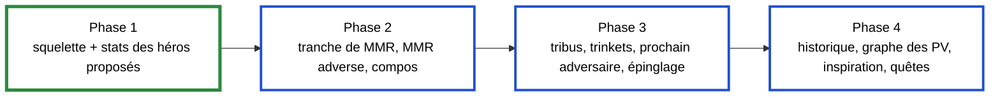

<!-- tablette : plan du plugin HDT -->

# Plan : plugin HDT pour la parité Firestone / HSReplay-Tier7

Suite de la spec `2026-09-26-parite-tier7-spec.md`. Quatre phases, dans l'ordre de la valeur
apportée ; chacune se termine par des tests verts sous WSL et une liste de contrôles à faire sous
Windows.

## Structure du code

| Projet | Cible | Contenu | Dépend de |
|---|---|---|---|
| `src/BronzebeardHud.Stats` | `netstandard2.0` | format local, chargeur, import Firestone, cache, tiers, héros proposés, lignes du panneau | Newtonsoft.Json 13.0.3, la version que charge HDT |
| `src/BronzebeardHud.HdtPlugin` | `net48` | `IPlugin`, panneau WPF écrit en C# (sans XAML), adaptation des entités HDT | HDT (téléchargé, hors git), `BronzebeardHud.Stats` |
| `tests/BronzebeardHud.Stats.Tests` | `net8.0` | xUnit, comme les autres projets de test | `BronzebeardHud.Stats` |

Le plugin reste **hors de la solution** : `dotnet test` n'a ainsi besoin ni du réseau ni de HDT. La
bibliothèque et ses tests y entrent. L'assembly HDT est téléchargée par une cible MSBuild du projet
plugin, dans `lib/hdt/<version>/`, qui est ignoré par git.

## Phase 1 : squelette et stats des héros proposés

| Fonctionnalité | Fichiers | Tests (valeurs distinctes) |
|---|---|---|
| F1. Format local et chargeur | `HeroStatsFile.cs`, `HeroStatsLoader.cs`, `StatsFormatException.cs` | fichier valide à trois héros différents ; JSON cassé ; schéma inconnu ; champ manquant ; place hors de [1, 8] ; héros en double ; source inconnue |
| F2. Import Firestone et cache | `FirestoneEndpoints.cs`, `FirestoneHeroStatsImporter.cs`, `StatsCache.cs`, `RefreshPolicy.cs`, `IStatsFetcher.cs`, `HttpStatsFetcher.cs` | conversion d'un extrait synthétique (taux de choix, distribution) ; URL par tranche et période ; cache frais → aucun appel ; cache périmé → un appel ; échec → cache conservé et délai d'1 h ; réponse malformée → cache intact |
| F3. Tiers et lignes du panneau | `HeroTiers.cs`, `HeroIdNormalizer.cs`, `OfferedHeroes.cs`, `HeroPickAdvisor.cs` | bornes des tiers S à E sur des places distinctes ; tier fourni par la source prioritaire ; skins ramenés au parent ; héros verrouillé exclu ; héros sans stats signalé ; ordre des héros proposés |
| F4. Squelette du plugin | `Plugin.cs`, `HeroPickPanel.cs`, `HdtEntityAdapter.cs` | aucun sous WSL (dépend de HDT) ; le build doit passer |

**Sous WSL** : tous les tests, et le build du plugin. **Sous Windows** : les cinq points de la section 5
de la spec.

## Phase 2 : tranche de MMR, MMR adverse, compositions

| Fonctionnalité | Fichiers | Tests |
|---|---|---|
| Tranche de MMR (livrée) | `MmrBracket.cs` ; la table `mmrPercentiles` vient du fichier de héros lui-même, sans endpoint de plus | MMR sous le seuil du top 50 %, pile sur un seuil, entre deux seuils, au-dessus du top 1 % ; table vide ; pas de note |
| MMR des adversaires (livré) | `Leaderboard.cs` (client, index, lobby → tuile, disposition) ; `OpponentMmrPanel.cs` | page 1 puis remontée depuis la dernière, arrêt au-dessus de la plage, pause d'1 s, plafond de 60 pages ; nom avec `#1234` et casse ; homonymes ; page non-200 ; JSON tronqué ; lobby → tuile par le héros |
| **Conseiller de compositions** (prioritaire, livré) | `CompositionFile.cs`, `FirestoneCompImporter.cs`, `HsReplayCompText.cs`, `CompAdvisor.cs`, `TavernLayout.cs` ; `CompService.cs`, `TavernAdvicePanel.cs` | classement sur 3 tours successifs, carte utile à deux compos, plateau vide, compo sans pièce, cartes clés par fréquence, texte HSReplay, cache 7 jours, disposition 3 à 7 sbires |
| Stats de compositions | intégrées au conseiller (import, cache, place moyenne dans le panneau) | — |

**Sous Windows** : noms du lobby fournis par `Core.Game.MetaData.BattlegroundsLobbyInfo`, placement
des panneaux.

### MMR des adversaires : quelle tranche du leaderboard télécharger

Décision d'Ali (2026-09-26) : la tranche qui tombe autour de son MMR, ajustable ensuite. **Région EU**,
établie par mesure et non supposée : l'identifiant de compte de ses parties dans HDT
(`BgsLastGames.xml`, attribut `Player`) a pour partie haute `0x200000257544347`, dont l'octet de
région vaut 2, c'est-à-dire EU (même décodage que `Helper.GetRegion` d'HDT).

Mesure du 2026-09-26 sur `hearthstone.blizzard.com/en-us/api/community/leaderboardsData?region=EU&leaderboardId=battlegrounds&page=N`
(saison 19 ; 121 pages de 25 joueurs, 3 022 joueurs en tout) :

| Page | Rangs | MMR |
|---|---|---|
| 1 | 1 – 25 | 14 613 – 18 218 |
| 40 | 976 – 1 000 | 8 782 – 8 803 |
| 65 | 1 601 – 1 625 | 8 244 – 8 261 |
| 90 | 2 226 – 2 250 | 8 050 – 8 052 |
| 105 | 2 601 – 2 625 | 8 022 – 8 024 |
| 121 | 3 001 – 3 022 | 8 000 |

**Le leaderboard s'arrête à 8 000.** Ali est à 6 840 : la marge envisagée (−600 / +800, soit 6 240 à
7 640) ne contient aucune page. La tranche retenue par défaut est donc le bas du classement, la plus
proche de son MMR : **8 000 à 8 050, soit les pages 90 à 121 ce jour-là (32 requêtes)**. Chaque page
pèse 304 Ko, dont 1,5 Ko de lignes ; le reste est de la métadonnée de saison.

| Réglage | Valeur par défaut | Où le changer |
|---|---|---|
| `LeaderboardRange` : `Region`, `MinRating`, `MaxRating` | `EU`, 8 000, 8 050 | `LeaderboardRange.Default` dans `src/BronzebeardHud.Stats/LeaderboardRange.cs` ; le plugin n'a pas encore d'écran de réglages |

Les bornes sont en MMR, et non en pages, pour deux raisons : Ali raisonne en MMR, et une page glisse
pendant la saison à mesure que des joueurs passent 8 000. Le client de la phase 2 convertira donc les
bornes en pages au moment de télécharger : il part de la dernière page et remonte tant que le MMR
reste sous `MaxRating`.

## Phase 3 : tribus, trinkets, prochain adversaire, épinglage

| Fonctionnalité | Fichiers | Tests |
|---|---|---|
| Impact des tribus du lobby | `TribeImpact.cs` (règle `buildHeroStats` de Firestone) | tribus absentes, présentes, filtrage des effectifs trop faibles |
| Stats de trinkets | `FirestoneTrinketStatsImporter.cs`, `TrinketPanel.cs` | conversion, trinkets proposés |
| Prochain adversaire | `NextOpponent.cs` | identifiant présent, absent, joueur mort |
| Épinglage en taverne | `TavernPins.cs`, `PinOverlay.cs` | épingle, retire, persiste d'une partie à l'autre |

## Phase 4 : historique, graphe des PV, inspiration, quêtes

`CombatHistory.cs`, `HealthGraph.cs`, `InspirationBoards.cs`, `QuestStats.cs`, testés sur des
séquences de trois tours au moins, pour qu'un état qui se piège lui-même se voie. **Sous Windows** :
tout le rendu.

## Ce qui reste un arbitrage d'Ali

1. Les tranches de MMR de HSReplay n'ont pas été vérifiées (le site nous répond 403) : pour une
   saisie manuelle, `mmrPercentile` reçoit le percentile affiché par HSReplay s'il en montre un, et
   reste vide sinon.
2. ~~L'utilité du MMR adverse sous 8 000.~~ **Tranché le 2026-09-26 : Ali garde le MMR adverse tel quel, plage par défaut EU 8 000 – 8 050.**
