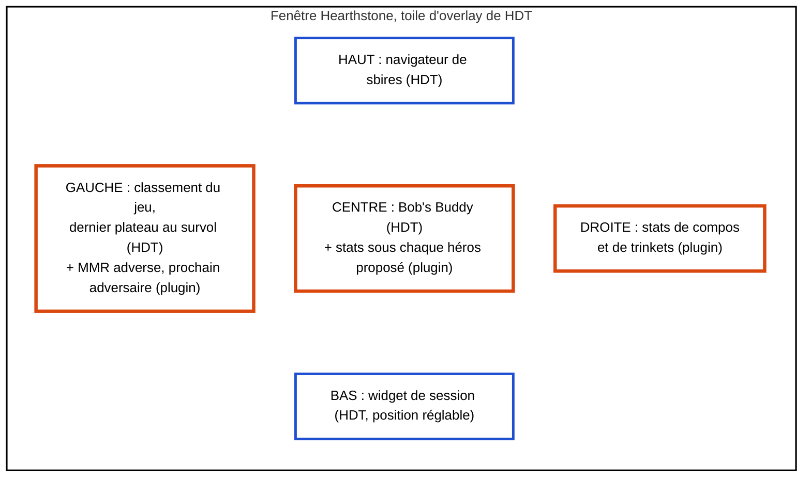

<!-- tablette : spec du plugin HDT -->

# Spec : parité Firestone / HSReplay-Tier7 par un plugin Hearthstone Deck Tracker

Décision d'Ali du 2026-09-26 : option 3 de l'étude de stack (`bg_treehudder`,
`docs/plans/2026-09-26-etude-stack.md`). Hearthstone Deck Tracker (HDT) fournit déjà l'overlay
Battlegrounds gratuit de HSReplay. Le plugin ajoute ce qui manque et **ne lit jamais la mémoire du
jeu** : il consomme l'état que HDT lui expose, plus des données externes.

## 1. Inventaire des fonctionnalités

Priorité : 1 = cœur de la parité, 2 = attendu, 3 = confort. *Qui la fournit* : `HDT déjà`,
`plugin, données HDT`, `plugin, données externes : …` ou `impossible`.

| Fonctionnalité | Origine | Affiche, et quand | Données | Qui la fournit | Prio |
|---|---|---|---|---|---|
| Cotes de combat (Bob's Buddy) | les deux | % victoire, nul, défaite, létal ; au combat | plateaux révélés | HDT déjà | 1 |
| Navigateur de sbires | les deux | pool de la partie par tier, tribu, mécanique ; en boutique | cartes, tribus du lobby | HDT déjà | 1 |
| Tribus disponibles et bannies | les deux | liste dès le tour 0 | mémoire, lue par HDT | HDT déjà | 1 |
| Dernier plateau au survol du classement | les deux | plateau, tier ; au survol d'un portrait | plateaux révélés, cible du survol | HDT déjà | 1 |
| Widget de session | les deux | MMR, 8 dernières parties, plateaux finaux | mémoire et logs | HDT déjà | 2 |
| Compteurs (gemmes de sang, or du tour suivant…) | les deux | valeurs en continu | tags d'entités | HDT déjà | 2 |
| Guides rédigés (héros, compos, trinkets) | HSReplay | texte de Jeef, selon la phase | contenu rédactionnel | HDT déjà | 3 |
| Tier 7 auto, Dark Paradox | HSReplay | ajouts au navigateur de sbires | tags | HDT déjà | 3 |
| **Stats des héros proposés** | les deux | tier, place moyenne, taux de choix ; à la sélection | héros proposés, stats agrégées | plugin, données externes : JSON de héros de Firestone, saisie HSReplay | 1 |
| Tranche de MMR des stats | les deux | les mêmes stats pour ta tranche | MMR du joueur, percentiles | plugin, données externes : `mmr-percentiles` ; MMR fourni par HDT | 1 |
| **MMR des adversaires** | Firestone | MMR et rang près du classement ; toute la partie | noms du lobby, classement public | plugin, données externes : leaderboard Blizzard ; noms fournis par HDT | 1 |
| Stats de compositions | les deux | tier des compos, place moyenne, affinité avec ton héros ; en boutique | stats agrégées | plugin, données externes : JSON de compos de Firestone | 1 |
| Impact des tribus du lobby sur un héros | Firestone | place moyenne corrigée ; à la sélection | `tribeStats`, tribus du lobby | plugin, données externes : JSON de héros ; tribus fournies par HDT | 2 |
| Stats des trinkets proposés | les deux | place moyenne ; au choix | stats agrégées | plugin, données externes : JSON de trinkets de Firestone | 2 |
| Prochain adversaire mis en évidence | projet | marque sur le classement | `NEXT_OPPONENT_PLAYER_ID` | plugin, données HDT | 2 |
| Épingler ou surligner un sbire en taverne | les deux | cadre sur la carte ; en boutique | cartes de la taverne | plugin, données HDT | 2 |
| Montées et triples depuis le dernier combat | Firestone | ajout au popup de survol | tags `PLAYER_TECH_LEVEL`, `PLAYER_TRIPLES` | plugin, données HDT | 2 |
| Stats de quêtes et récompenses | les deux | tours pour finir, place moyenne | stats agrégées | plugin, données externes : JSON de quêtes de Firestone | 3 |
| Historique des combats de la partie | Firestone | liste des combats, dégâts | événements de combat | plugin, données HDT | 3 |
| Graphe des PV de tous les joueurs | Firestone | courbes par tour | `HEALTH`, `DAMAGE` | plugin, données HDT | 3 |
| Plateaux d'inspiration | HSReplay | plateaux finaux réels d'une compo | `finalBoards` du JSON de compos | plugin, données externes : JSON de compos de Firestone | 3 |
| Bilan contre chaque adversaire du lobby | Firestone | victoires et défaites | historique local | plugin, données HDT | 3 |
| Pièces clés d'une compo, quand s'engager | HSReplay | alerte en taverne | contenu Tier7 | plugin, données externes : saisie HSReplay | 3 |
| Détail « comment les tops jouent ce sbire » | HSReplay | au clic dans le navigateur | données HSReplay non publiques | impossible | — |
| Plateau adverse en temps réel | — | — | le jeu ne l'écrit nulle part | impossible | — |

## 2. Les données de stats

**Provenance.** Firestone publie ses agrégats en JSON statique ; l'auteur a donné son accord à Ali le
2026-09-26 pour qu'on les récupère nous-mêmes depuis les endpoints qu'utilise l'application.

| Fichier | URL (`%…%` = paramètre) | Où Firestone la construit |
|---|---|---|
| Héros | `https://static.zerotoheroes.com/api/bgs/hero-stats/mmr-%p%/%t%/overview-from-hourly.gz.json` | `libs/battlegrounds/data-access/src/lib/meta-heroes/bgs-meta-hero-stats-access.service.ts` |
| Percentiles de MMR | `https://static.zerotoheroes.com/api/bgs/hero-stats/%t%/mmr-percentiles.gz.json` | même fichier |
| Compositions | `https://static.zerotoheroes.com/api/bgs/comp-stats/%t%/overview-from-hourly.gz.json` | `libs/battlegrounds/services/src/lib/services/bgs-comps.service.ts` |

`%p%` ∈ {100, 50, 25, 10, 1} (100 = tous les joueurs, 1 = le top 1 %) ; `%t%` ∈ {`last-patch`,
`past-three`, `past-seven`, `all-time`} (`bgs-active-time-filter.type.ts`). Les données HSReplay, elles,
sont **copiées à la main** par Ali depuis le site : aucun accès automatisé à hsreplay.net.

**Format local.** Un fichier JSON par source, période et tranche. Le même format sert aux deux
sources ; seuls `source` et les champs facultatifs changent.

```json
{
  "schema": 1,
  "source": "firestone",
  "sourceUrl": "https://static.zerotoheroes.com/api/bgs/hero-stats/mmr-100/last-patch/overview-from-hourly.gz.json",
  "generatedAt": "2026-09-26T12:10:35Z",
  "fetchedAt": "2026-09-26T17:33:00Z",
  "mmrPercentile": 100,
  "timePeriod": "last-patch",
  "heroes": [
    { "heroCardId": "TB_BaconShop_HERO_39", "averagePlacement": 4.29, "dataPoints": 1125,
      "pickRate": 0.0843, "tier": null,
      "placementDistribution": [10.4, 12.44, 11.2, 12.9, 13.0, 13.1, 13.4, 13.56] }
  ]
}
```

| Champ | Obligatoire | Règle |
|---|---|---|
| `schema` | oui | vaut 1 ; toute autre valeur est refusée |
| `source` | oui | `firestone` ou `hsreplay-manual` |
| `heroes[].heroCardId` | oui | identifiant du héros **de base** (skins ramenés au parent), unique dans le fichier |
| `heroes[].averagePlacement` | oui | dans [1, 8] |
| `heroes[].dataPoints` | oui | ≥ 0 (0 pour une saisie manuelle sans effectif) |
| `pickRate`, `placementDistribution` | non | `pickRate` dans [0, 1] ; distribution de 8 pourcentages |
| `tier` | non | la lettre affichée par la source (HSReplay va de S à F) ; absente → calculée par la règle de Firestone, si le fichier compte au moins 20 héros (en deçà, ce n'est pas un pool et aucun tier n'est affiché) |
| `generatedAt`, `fetchedAt`, `sourceUrl`, `mmrPercentile`, `timePeriod` | non | traçabilité, affichés en infobulle |

Un fichier qui viole une règle est **refusé en entier**, avec un message qui nomme le champ fautif :
on n'affiche jamais une stat douteuse.

**Tier calculé** (règle de Firestone, `bgs-meta-hero-stats.ts`, `buildTiers`) : sur tous les héros du
fichier, moyenne μ et écart-type σ (population) des places moyennes ; S < μ−3σ ≤ A < μ−1,5σ ≤ B < μ ≤
C < μ+σ ≤ D < μ+2σ ≤ E ≤ 8.

**Politique de récupération.**

| Règle | Valeur | Pourquoi |
|---|---|---|
| Âge maximal du cache, héros | 24 h | Firestone régénère toutes les heures, mais une stat « dernier patch » bouge peu en une journée ; environ 0,5 Mo par jour |
| Âge maximal du cache, compositions | 7 jours | 31,5 Mo par téléchargement, dont 2,4 Mo de plateaux finaux par archétype |
| Délai après un échec | 1 h | pas de nouvel essai à chaque sélection de héros quand le réseau manque |
| Déclencheur | ouverture de la sélection de héros, jamais en tâche de fond | on ne télécharge que ce que l'écran va montrer |
| Écriture | fichier temporaire, puis renommage | un téléchargement raté ou malformé n'écrase jamais un cache valide |
| Périmètre | la seule combinaison tranche × période affichée | aucun moissonnage des autres combinaisons |

## 3. Disposition cible



*Bleu : ce que HDT affiche de série. Orange : les zones où le plugin ajoute quelque chose.*

## 4. Hors périmètre définitif

| Quoi | Pourquoi |
|---|---|
| Simulateur de combat dans le plugin | Bob's Buddy le fournit déjà dans HDT |
| Lecture mémoire par le plugin | décision d'Ali : seul HDT la fait |
| Plateau adverse en temps réel | ni le log ni l'état de HDT ne le portent |
| Données privées de HSReplay (détails par sbire, lignes des tops) | pas d'accès public ; la saisie manuelle ne couvre que des tableaux |
| Textes de stratégie de Firestone (`bgs-*-strategies.gz.json`) | contenu rédactionnel hors de l'accord sur les stats ; HDT a déjà les guides de Jeef |
| Compte, backend, envoi de parties | aucun service à nous ; rien ne quitte la machine |

## 5. Ce qui ne se vérifie que sous Windows, avec HDT installé

1. Le chargement du plugin par HDT (DLL copiée dans `%AppData%\HearthstoneDeckTracker\Plugins`),
   son activation dans *Options > Tracker > Plugins*, et la compatibilité de l'API avec la version
   installée : on compile contre la release GitHub 1.55.6.
2. Le rendu du panneau sur la toile d'overlay : position, taille, lisibilité en jeu.
3. La réception des événements réels : `OnUpdate`, passage en sélection de héros, entités proposées
   avec leurs tags, skins.
4. Le téléchargement réel depuis le processus HDT : proxy, TLS de .NET Framework 4.8, droits
   d'écriture dans le dossier de cache.
5. L'absence de conflit d'assemblies dans le processus HDT, Newtonsoft.Json compris.

**Vérifié par Ali le 2026-09-26, sous HDT 1.58.3** : les points 1, 3 et 4 (plugin chargé et activé,
sélection de héros détectée, stats Firestone réelles téléchargées et affichées) ; le point 5 n'a
posé aucun problème visible. Le point 2 a révélé un défaut d'alignement (un seul bloc, qui débordait
sur le bouton OK). Il est corrigé par `HeroPickLayout`, une pastille par héros placée avec la méthode
d'HDT, et **reste à revérifier**.
